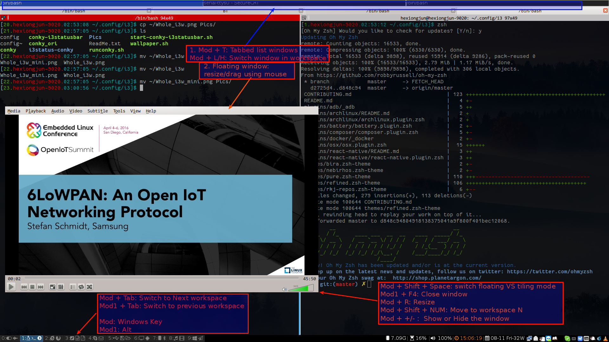

i3wm with conky status bar
===

i3wm and conky setting/configurations files.
Based on [ This ](https://github.com/levinit/i3wm-config "i3wm-config") and I did some modification to make it more usable.

----------

#  Setup #
- Install the necessary packagess:
  - conky
  - dmenu
  - feh
  - terminator
  - xcompmgr
  - scrot and ksnapshot
  - alsa-utils
  - networkmanager、nm-connection-editor nm-applet

- Clone the repo into ~/.config/i3

    `git clone https://github.com/tonyho/i3wm-conky-config.git ~/.config/i3`
    `cd ~/.config/i3`

- Install the font i3status-conky/fontawesome-webfont.ttf

- Give the executable permission for files

    `chmod +x wallpaper.sh /home/$USER/.config/i3/i3status-conky/i3status.sh`

- Setup the wallpaper and lock picture

    `cp wallpaper -r ~/Pictures`

    `cp wallpaper/lock/lock.jpg ~/Pictures/`

- Get the window list jumper script
    `wget https://raw.githubusercontent.com/minos-org/minos-desktop-tools/master/tools/dmenu-i3-window-jumper`

----------
# Keybindings
The basic key bindings is following:

Also we can use the `Mod+p` to jump to the opened windw by searching its title

# Tips
- TeamViewer: Move it to a worksapce(Mod + Shift + N) and make it fullscreen(Mod + f)
- ScreenShot: Use the ksnapshot launched by DMemu(Mod + d)
- Picture Edit: Use the shutter or GIMP
- Lock or quit: Mod + Shift + q, then press the corresponding key
- File Explorer: Mod + e, or launch the `nautilus --no-desktop .` in terminal
- Switch to terminal(Ctrl + Alt + F1~F6) to close the application:

    When an application overlay the i3 worksapce and can't switch to other workspace,
    and cannot close that application
- It takes a little time to be effect when update the conky status bar configuration
